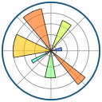
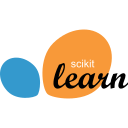
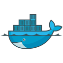

  

<h1 align="center">
<!-- Typing SVG source: https://github.com/DenverCoder1/readme-typing-svg -->
    
  
</h1>

# About Me
- **Current Role:** Data Scientist at the National Physical Laboratory's (NPL) Informatics Group

- **Location:** London and Glasgow

- **Education:**
  - University of Cambridge | Data Science, Machine Learning, and AI | Postgraduate Study (Level 7)
  - University of Bath | Physics and Chemistry | BSc (Hons) First-class honours

- **Interests & Hobbies:**
  - **🏋️‍♂️ Health:** Gym (powerlifting & bodybuilding), hiking, and nutrition
  - **📈 Finance:** Personal budgeting and investment strategy
  - **🏍️ Motorbikes:** Sports bike enthusiast enjoying the open road
  - **🛫 Aviation:** Plane spotting and systematic failure documentaries
  - **🍽️ Culinary:** Cooking, baking, and optimising recipes

# Key Projects

<table style="margin-top: -25px; margin-bottom: 50px">
  <tr>
    <th align="left" width="25%">
      <h3>Core Competency</h3>
    </th>
    <th align="left" width="50%">
      <h3>Project Description</h3>
    </th>
    <th align="left" width="25%">
      <h3>Tech Stack</h3>
    </th>
  </tr>
  <tr>
    <td align="left">
      <strong>📰 LLMs and NLP</strong>
    </td>
    <td align="left">
      <strong>Bank of England IFRS9 ECL Forecasting</strong> <em>[In Progress]</em> 
      Bank of England collaboration parsing Basel Pillar 3 PDFs via LLMs to derive an anxiety index with FinBERT. Integrated with macro drivers (Base Rate, CPI, FTSE 100) in a multivariate time series pipeline to forecast IFRS 9 Expected Credit Loss.
    </td>
    <td align="left">
      LLMs, structured evidence stores, FinBERT, XGBoost, Vector Autoregression, SHAP
    </td>
  </tr>
  <tr>
    <td align="left">
      <strong>🏦 Customer Churn Modelling</strong>
    </td>
    <td align="left">
      <strong>Predictive Customer Credit Risk Modelling</strong> 
      Engineered an end-to-end loan default prediction pipeline, querying complex hierarchical relational databases with SQL to capture credit behaviour signals. Filtered uninformative variables using random bar (probe feature) selection and used SHAP for model explainability.
    </td>
    <td align="left">
      DuckDB, SQL, LightGBM, SHAP
    </td>
  </tr>
  <tr>
    <td align="left">
      <strong>📈 Time Series Forecasting</strong>
    </td>
    <td align="left">
      <a href="https://github.com/harveywhelan/time-series-procurement-optimisation" target="_blank" rel="noopener noreferrer" title="Click to go to the GitHub Repo for this project" aria-label="Clickable link for the GitHub repo."><strong>Nielsen Book Sales Revenue Forecasting</strong></a> 
      Developed a weekly sales forecasting pipeline using Nielsen BookScan data for inventory optimisation. Resolved COVID-19 anomalies via STL imputation and Box-Cox/Log transformations, benchmarking Auto-ARIMA, XGBoost, and LSTMs against sequential and parallel hybrid models.
    </td>
    <td align="left">
      Auto-ARIMA, XGBoost, LSTMs, STL Decomposition, Anomalous Period Imputation, ACF, PACF, Residual Prediction/Hybrid Models
    </td>
  </tr>
  <tr>
    <td align="left">
      <strong>🚨 Risk & Rare Event Detection</strong>
    </td>
    <td align="left">
      <a href="https://github.com/harveywhelan/maritime-anomaly-detection" target="_blank" rel="noopener noreferrer" title="Click to go to the GitHub Repo for this project" aria-label="Clickable link for the GitHub repo."><strong>Maritime Anomaly Detection</strong></a> 
      Engineered an anomaly detection pipeline for telemetry data, akin to financial anti-fraud systems. Benchmarked unsupervised OCSVM and Isolation Forests against baseline IQR thresholds. Selected Isolation Forests for optimal efficiency and explainability.
    </td>
    <td align="left">
      Isolation Forest, OCSVM, IQR,  PCA
    </td>
  </tr>
  <tr>
    <td align="left">
      <strong>🫂 Behavioral Clustering</strong>
    </td>
    <td align="left">
      <a href="https://github.com/harveywhelan/ecommerce-customer-segmentation" target="_blank" rel="noopener noreferrer" title="Click to go to the GitHub Repo for this project" aria-label="Clickable link for the GitHub repo."><strong>E-Commerce Customer Profiling</strong></a> 
      Engineered a K-Means customer segmentation pipeline using Recency, Frequency, and CLV features to derive five buyer personas for targeted marketing. Optimized clusters via Silhouette Scores and Ward dendrograms, validating separability with PCA and t-SNE.
    </td>
    <td align="left">
      K-Means, Silhouette Score, Elbow Method, PCA, t-SNE, Hierarchical Clustering, Dendrograms
    </td>
  </tr>
</table>

# Tech Stack and Tools

<!-- Languages and Databases -->
<table>
  <tr>
    <th colspan="3" align="left">
      <h3>Languages and Databases</h3>
    </th>
  </tr>
  <tr>
    <td align="center" width="20">
      
       <strong>Python</strong>
    </td>
    <td align="center" width="20">
      
       <strong>PostgresSQL</strong>
    </td>
    <td align="center" width="2">
      
       <strong>DuckDB</strong>
    </td>
  </tr>
</table>  

<!-- Data Science and Visualisation -->
<table>
  <tr>
    <th colspan="3" align="left">
      <h3>📊 Data Science and Visualisation</h3>
    </th>
  </tr>
  <tr>
    <td align="center" width="20">
      
       <strong>Pandas</strong>
    </td>
    <td align="center" width="20">
      
       <strong>NumPy</strong>
    </td>
    <td align="center" width="20">
      
       <strong>Matplotlib</strong>
    </td>
  </tr>
</table>

  <!-- Machine and Deep Learning -->
<table>
  <tr>
    <th colspan="4" align="left">
      <h3>🧠 Machine and Deep Learning</h3>
    </th>
  </tr>
  <tr>
    <td align="center" width="20">
      
       <strong>Scikit-Learn</strong>
    </td>
    <td align="center" width="20">
      
       <strong>TensorFlow</strong>
    </td>
    <td align="center" width="20">
      
       <strong>Keras</strong>
    </td>
    <td align="center" width="20">
      
       <strong>Hugging Face</strong>
    </td>
  </tr>
</table>

<!-- Cloud and Development Environments -->
<table>
  <tr>
    <th colspan="8" align="left">
      <h3>☁️ Cloud & Development Tools</h3>
    </th>
  </tr>
  <tr>
    <td align="center" width="20">
      
       <strong>AWS</strong>
    </td>
    <td align="center" width="20">
      
       <strong>Git</strong>
    </td>
    <td align="center" width="20">
      
       <strong>Docker</strong>
    </td>
    <td align="center" width="20">
      
       <strong>Jupyter</strong>
    </td>    
    <td align="center" width="20">
      
       <strong>VS Code</strong>
    </td>
    <td align="center" width="20">
      
       <strong>Anaconda</strong>
    </td>
    <td align="center" width="20">
      
       <strong>Spyder</strong>
    </td>
    <td align="center" width="20">
      
       <strong>GitHub</strong>
    </td>
  </tr>
  <tr>
    <td align="center" width="20">
      
       <strong>GitLab</strong>
    </td>
    <td align="center" width="20">
      
       <strong>SourceTree</strong>
    </td>
    <td align="center" width="20">
      
       <strong>Google Colab</strong>
    </td>
    <td align="center" width="20">
      
       <strong>NetworkX</strong>
    </td>
    <td align="center" width="20">
      
       <strong>Protégé</strong>
    </td>
    <td align="center" width="20">
      
       <strong>FastAPI</strong>
    </td>
    <td width="20"></td>
    <td width="20"></td>
  </tr>
</table> 

<!-- Operating Systems -->
<table>
  <tr>
    <th colspan="2" align="left">
      <h3>🖥️ Operating Systems</h3>
    </th>
  </tr>
  <tr>
    <td align="center" width="20">
      
       <strong>Linux</strong>
    </td>
    <td align="center" width="20">
      
       <strong>Windows</strong>
    </td>
  </tr>
</table>

# Let's Connect!

<table>

  <tr>
    <td align="center">
      
       <strong>LinkedIn</strong>
    </td>
  </tr>
</table>